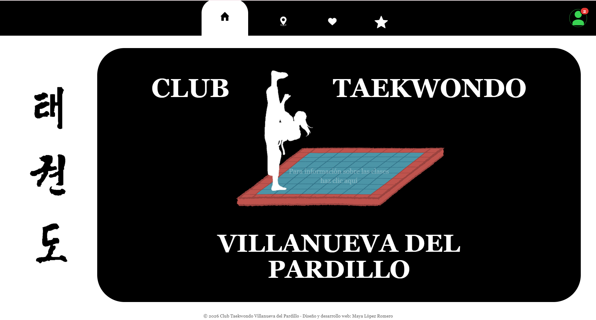
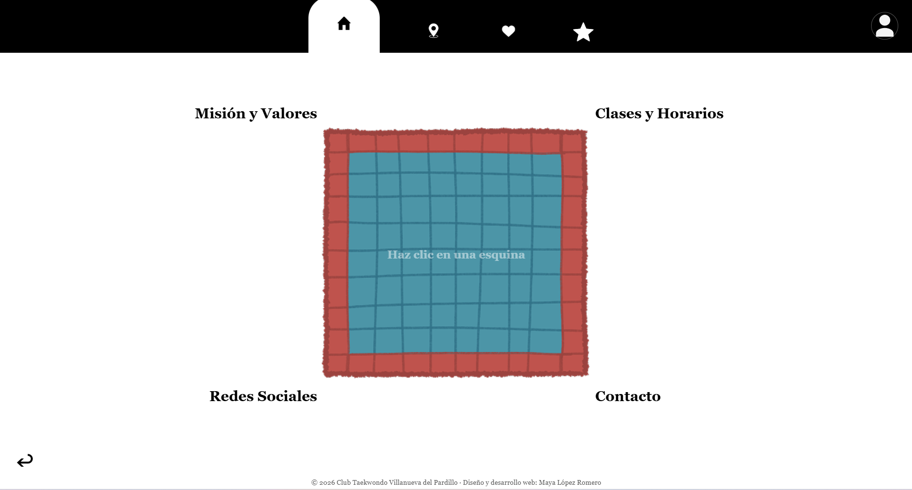
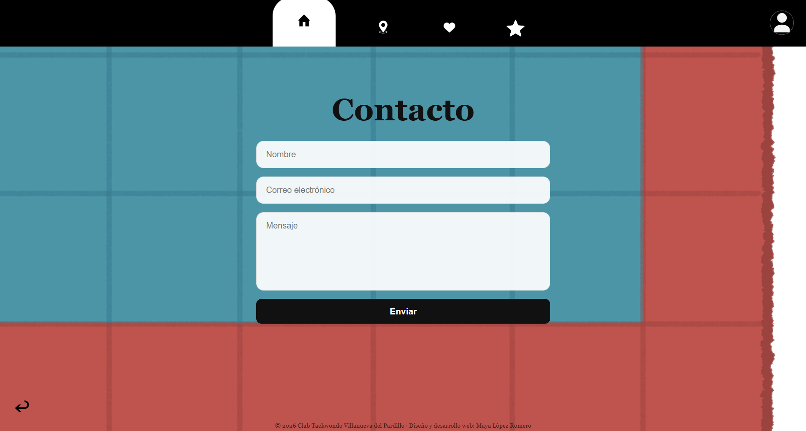
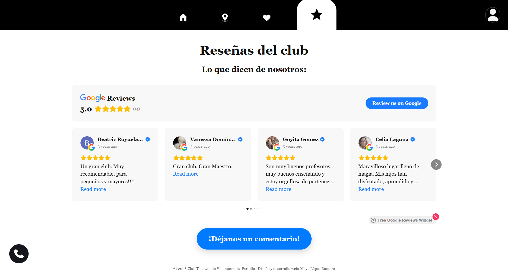
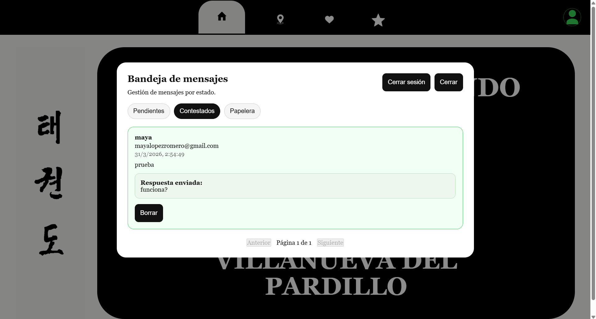

# Taekwondo Club Web Platform

This project is a full-stack web application developed for a Taekwondo club. It represents an evolution from an initial static website into a more structured and functional system with a custom backend and interactive frontend.

---

## Preview

---

## Project Background

The first version of this website was built as a simple static page using HTML and CSS, focused on presenting basic information about the club.

This second version was developed to extend that initial concept into a complete application. The goal was to introduce backend functionality, structured data handling, and a more interactive user experience.

---

## Design Process

The interface was first fully designed in Figma before any implementation.

The design phase included:
- Layout structure
- Navigation flow
- Interactive elements (tatami navigation system)
- Visual hierarchy and transitions

The final implementation was built directly based on this design.

Figma prototype: (https://www.figma.com/proto/fq5wxFZx1ic4ZOZOkoeexy/Sin-t%C3%ADtulo?page-id=0%3A1&node-id=12-252&p=f&viewport=-479%2C18%2C0.39&t=NXWKtCGWDOSU75OB-1&scaling=scale-down&content-scaling=fixed&starting-point-node-id=1%3A3)

---

## Application Overview

The application consists of two main parts:

### Frontend
- Built with React
- Component-based structure
- Handles navigation, UI rendering, reviews integration, and user interaction

### Backend
- Built with Node.js and Express
- Provides a REST API for all data operations
- Handles authentication, message storage, admin workflows, logging, and email communication

---

## Key Features

### Interactive Navigation
- Central tatami element used as a navigation hub
- Users access different sections by clicking specific areas
- Structured UI flow from intro → home → detailed sections

### Contact System
- Users can submit messages through a form
- Messages are stored in a database

### Admin Panel
- Secure login system using JWT authentication
- Passwords stored using bcrypt hashing
- Protected message inbox with:
  - Status workflow (pending, answered, trash)
  - Pagination
  - Reply functionality
  - Message status updates
  - Pending message counter displayed in the admin icon

### Email Integration
- Admin responses are sent directly via SMTP
- Implemented using Nodemailer

### Reviews Integration
- Embedded Google Reviews widget for public user feedback
- Direct link for users to leave a review

### Logging
- Backend activity and error logging
- Logs stored in dedicated files for easier debugging and traceability

---

## Backend Architecture

The backend follows a modular structure:

- Routes: define API endpoints
- Controllers: handle request logic
- Services: manage business logic and database operations

This structure improves maintainability and scalability.

---

## Tech Stack

Frontend:
- React
- HTML, CSS

Backend:
- Node.js
- Express

Database:
- SQLite

Authentication:
- JWT
- bcrypt

Other:
- Nodemailer (email integration)
- Custom file-based logging
- Git (version control)

---

## Screenshots

### Navigation Hub

### Contact Section

### Reviews Section

### Admin Panel
